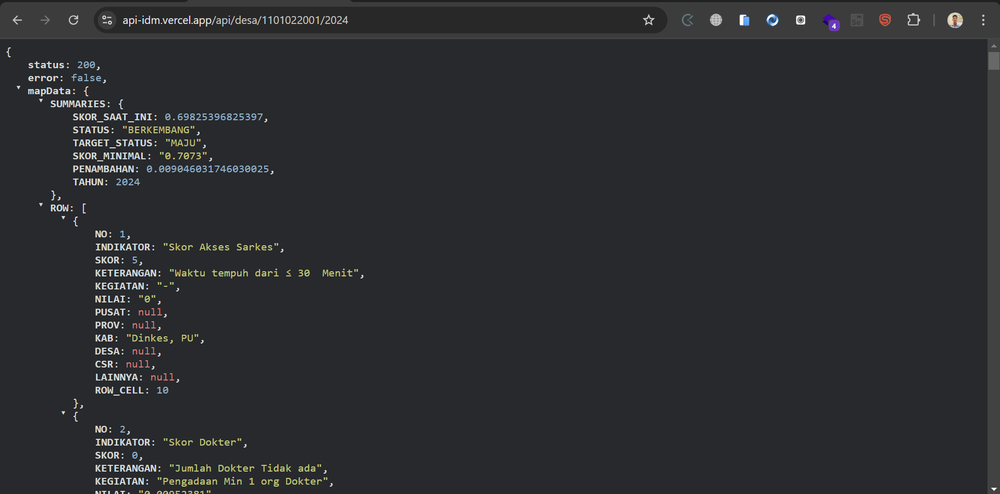

## Sumber Data
Data statis (.json) di ambil dari https://idm.kemendesa.go.id/open/api/desa/rumusan/[kode_desa]/[tahun]

## Cara Menggunakan Generator

1. **Tanpa argumen** (menggunakan `desa.csv` sebagai default):
   ```bash
   cd generator
   node index.js
2. **Dengan file CSV lain yang berada di folder data/**
    ```bash
    cd generator
    node index.js [file_excel].csv


## Cara Menggunakan API
```bash
https://api-idm.vercel.app/api/desa/[kode_desa]/[tahun]


